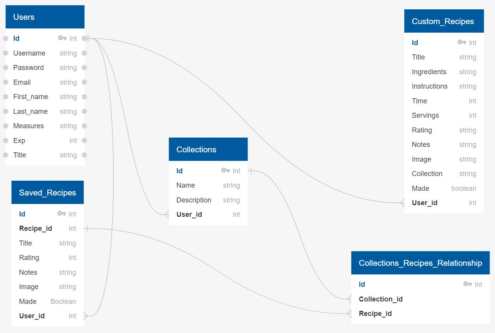

# Cooking Master

#### Introduction

During the pandemic, there were a lot of restrictions imposed on both the restaurants and diners. People didn’t have too many options but to either buy take-out or learn how to cook on their own.  

My website will help users to search and add recipes to their favorites.  Users will also be able to create and customize their own recipes.
The website will target the people who are either running out of ideas or struggling to find recipes for their meals.

One of the issues include not being able to extract information from the API as the allowable daily quota from the free plan is exceeded. 
Sensitive information includes user’s personal data such as names, usernames, passwords and email.

Users will have the ability to create, edit and save their own recipes other than finding and adding recipes to their collections. 

#### Database Schema

#### Functionality

* Allows visitors to register for a user account and sign in
* Non-registered visitors can still search but can not save recipes
* Allows users to create their collections (ex. Desserts, pastas, drinks, desserts, breakfasts, etc).
* Allows users to search, save and categorize recipes to their collections 
* Allows users to create and edit their own recipes
* Allows users to delete any recipes in their collections

#### User Flow

* Visitors can sign in, register or search recipes on the homepage
* Users can see their saved recipes and own recipes after they log in
* Users can create their own recipes
* Users can remove any saved recipes from their collections

#### Tools

* API - Spoonacular
* Others - Python, Flask, SQLAlchemy, WTForms, HTML, CSS, and JavaScript